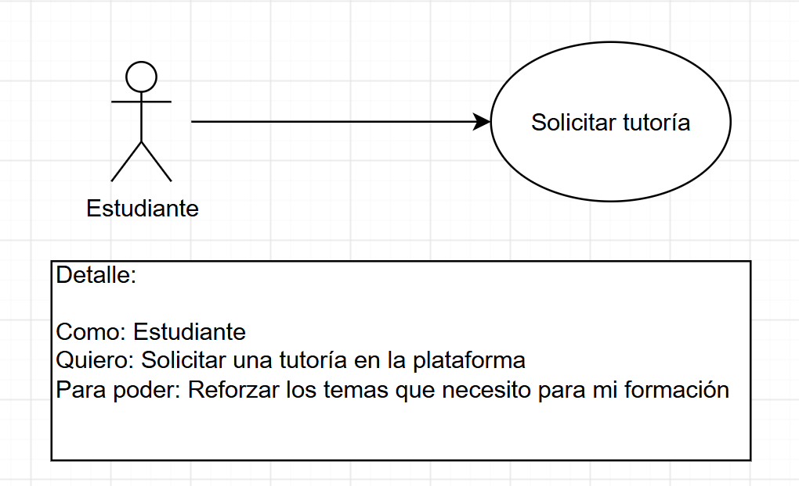
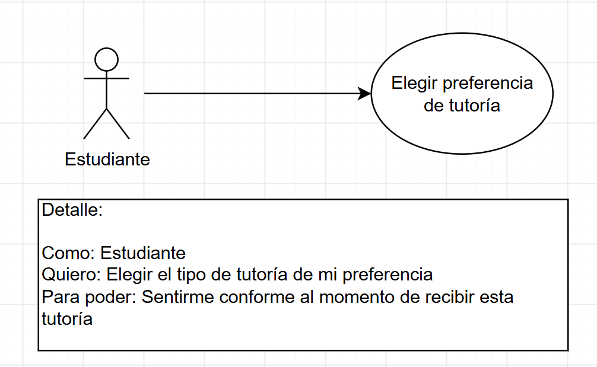
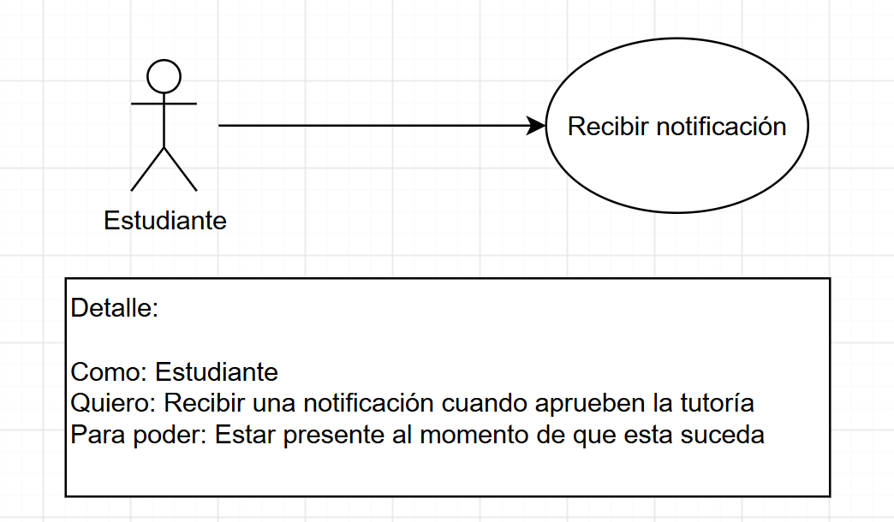
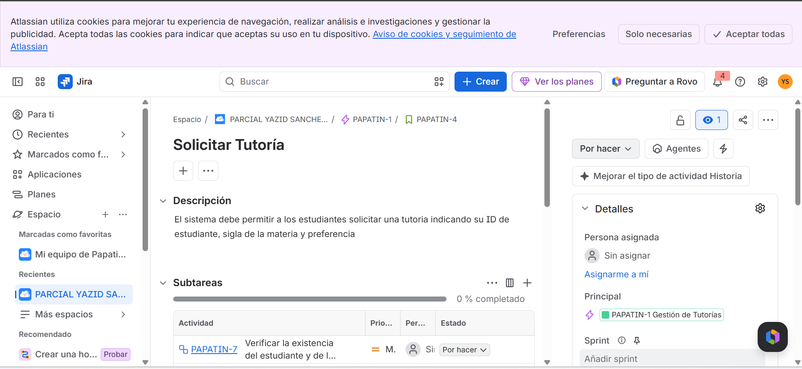
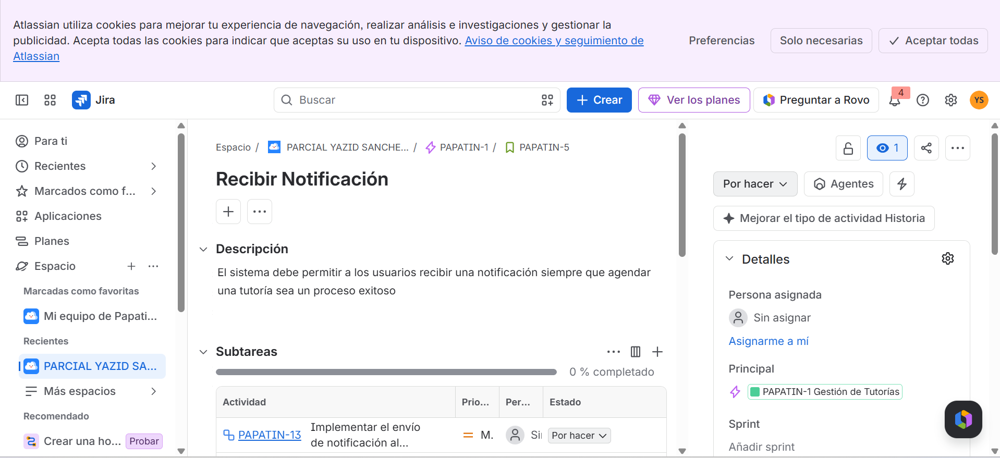
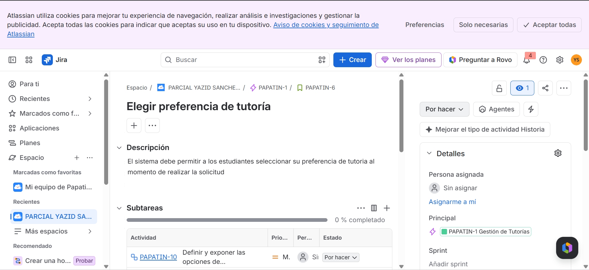

# DOSW_ParcialT1_Yazid-Sanchez

## Puntos a Desarrollar 

### 6. Diagrama de Contexto

# Requerimientos del Sistema

## 7. Lista general de requerimientos

El sistema de TutoECI tiene los siguientes requerimientos (descripción a alto nivel):

### 7.1 Requerimientos funcionales

El sistema de TutoECI debe tener la capacidad de:

1. Permitir a los estudiante solicitar una tutoria si este está inscrito activamente en la materia 
2. Permitir a los estudiantes recibir una notificación al confirmar su tutoría mediante NotifyMe
3. Permitir a los estudiantes elegir la preferencia que tengan en la solicitud de tutoria  (FASTEST_AVAILABLE / EXPERT_FIRST / PEER_TUTORING)

### 7.2 Requerimientos no funcionales

El sistema de TutoECI debe tener:

1. El sistema debe utilizar la paleta de colores definida para TutoECI en todas sus interfaces
2. La interfaz del sistema debe adaptarse a diferentes tamaños de pantalla, incluyendo móviles y computadores

## 7.1.0 Diagramas de caso de uso

### 7.1.1 Requerimiento Funcional 1

| **Campo** | **Descripción** |
| ---------------------------- | ------------------------------------------------------------------------------------- |
| **ID**                       | RF-01 |
| **Nombre del requerimiento** | Solicitar tutoria  |
| **Descripción**              | El sistema debe permitir a los estudiantes solicitar una tutoria indicando su ID de estudiante, sigla de la materia y preferencia  |
| **Precondiciones**           | El estudiante debe de estar inscrito activamente en la materia |
| **Actor**                    | Estudiante |
| **Flujo principal**          | 1.El estudiante debe seleccionar la opción para agendar una tutoria. 2. El sistema solicita la información del estudiante. 3. El estudiante ingresa ID, siglas de materia y preferencias de tutor. 4. El  sistema valida la información. 5. El sistema registra la solicitud de tutoria. 6. El sistema confirma la tutoría mediante una notificación |
| **Diagrama de caso de uso**  |  |
| **Poscondiciones**           | El sistema agenda la tutoría entre el estudiante y el profesor|
| **Enlace a mockup**           | vacio por el momento |

### 7.1.2 Requerimiento Funcional 2

| **Campo** | **Descripción** |
| ---------------------------- | ------------------------------------------------------------------------------------- |
| **ID**                       | RF-02 |
| **Nombre del requerimiento** | Recibir notificación |
| **Descripción**              | El sistema debe permitir a los usuarios recibir una notificación siempre que agendar una tutoría sea un proceso exitoso |
| **Precondiciones**           | El estudiante debe haber finalizado el proceso de solicitud de una tutoría|
| **Actor**                    | Estudiante |
| **Flujo principal**          | 1. El estudiante finaliza el proceso de solicitud de tutoria. 2. El sistema valida la solicitud. 3.El sistema, mediante Notifyme le hace saber al estudiante que su solicitud se aprobó. 4. El estudiante recibe la notificación de aceptación de su solicitud|
| **Diagrama de caso de uso**  |  |
| **Poscondiciones**           | El estudiante es notificado acerca de la aprovación de su solicitud |

### 7.1.3 Requerimiento Funcional 3

| **Campo** | **Descripción** |
| ---------------------------- | ------------------------------------------------------------------------------------- |
| **ID**                       | RF-03 |
| **Nombre del requerimiento** | Elegir preferencia de tutoría|
| **Descripción**              | El sistema debe permitir a los estudiantes seleccionar su preferencia de tutoria al momento de realizar la solicitud |
| **Precondiciones**           | El usuario debe estar inscrito activamente en la materia para realizar la solicitud |
| **Actor**                    | Estudiante |
| **Flujo principal**          | 1. El organizador consulta los equipos pendientes de aprobación. 2. El sistema muestra los equipos disponibles. 3. El organizador selecciona un equipo. 4. El sistema muestra la información del equipo y del pago realizado. 5. El organizador verifica el pago. 6. El organizador aprueba la inscripción. 7. El sistema registra al equipo como inscrito en el torneo activo. 1. El estudiante realiza el proceso de solicitud de inscripción hasta la sección de preferencias. 2. El sistema le ofrece al estudiante entre los 3 distintos tipos de tutoría según sus preferencias. 3. El estudiante selecciona una opción. 4. El sistema lo marca como valido|
| **Diagrama de caso de uso**  |  |
| **Poscondiciones**           | El estudiante recibe la tutoría según las preferencias que tuvo durante su selección |

## Desglose de trabajo: Épicas, Historias de Usuario y Tareas

# La implementación de los requerimientos identificados de TechCup se desglosa de la siguiente manera:

### 1. Épica: Gestión de torneos

| ID | Título | Stakeholder | Evidencia en Jira |
|:---:|---|---|---|
| EP-01 | Gestión de Tutorías | Plataforma |  |
--
### 2. Historias de usuario

| ID | Título de la Historia | Captura de Jira |
|:---:|---|---|
| HU-01 | Solicitar tutoria |  |
| HU-02 | Recibir notificación |  |
| HU-03 | Elegir preferencia de tutoría |  |
