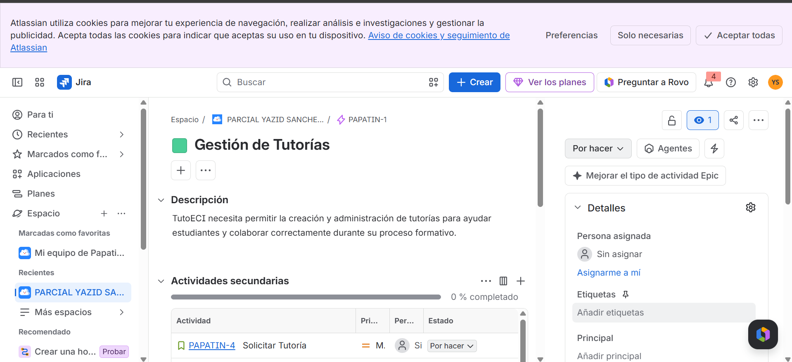

## Desglose de trabajo: Épicas, Historias de Usuario y Tareas

# La implementación de los requerimientos identificados de TechCup se desglosa de la siguiente manera:

### 1. Épica: Gestión de torneos

| ID | Título | Stakeholder | Evidencia en Jira |
|:---:|---|---|---|
| EP-01 | Gestión de Tutorías | Plataforma |  |
--
### 2. Historias de usuario

| ID | Título de la Historia | Captura de Jira |
|:---:|---|---|
| HU-01 | Solicitar tutoria |  |
| HU-02 | Recibir notificación |  |
| HU-03 | Elegir preferencia de tutoría |  |
